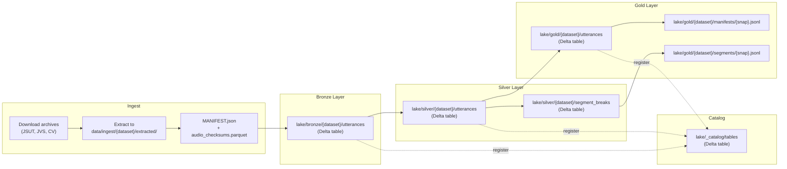
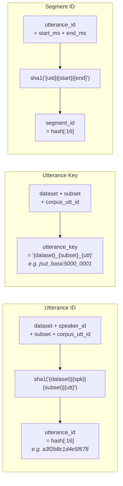
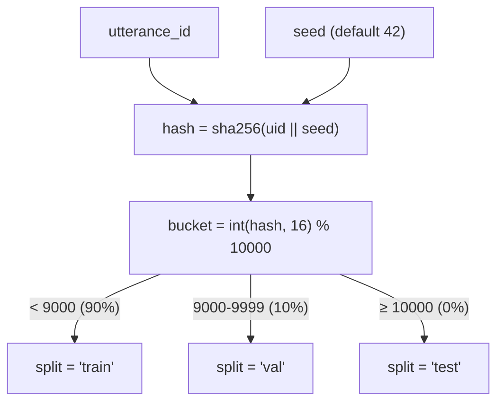
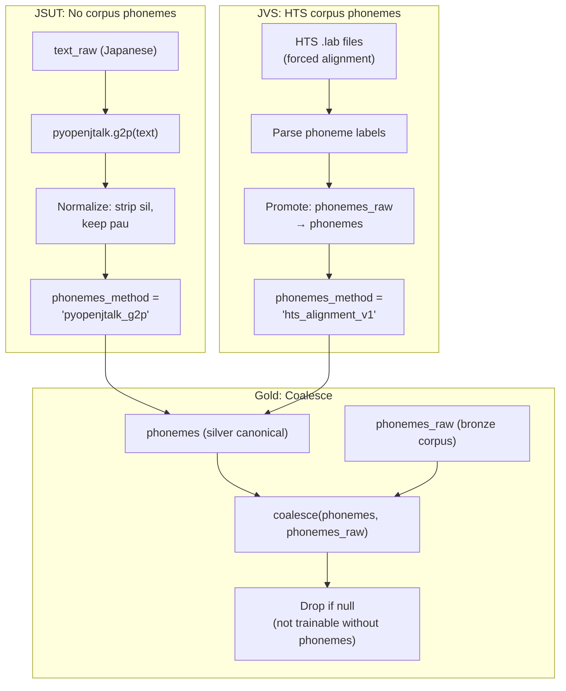
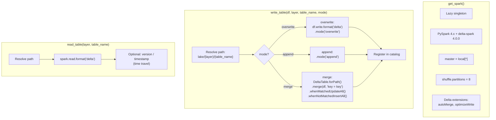
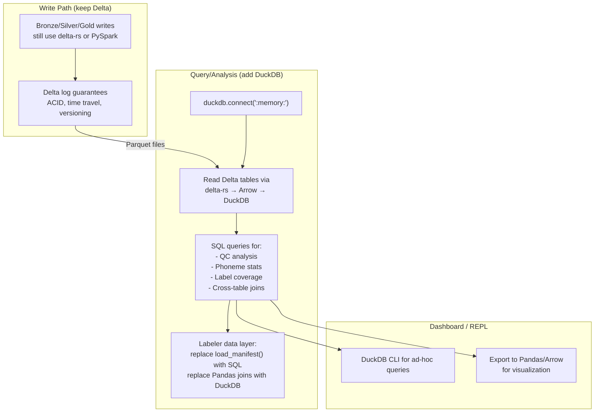

# Data Lake Architecture: Ingest → Bronze → Silver → Gold

## 1. High-Level Medallion Pipeline



## 2. Detailed Pipeline Flow

```mermaid
flowchart TD
    subgraph Ingest["koe ingest {dataset}"]
        I1["Download archive<br/>(HTTP/S3)"]
        I2["Verify checksum"]
        I3["Extract to<br/>data/ingest/{dataset}/extracted/"]
        I4["Compute audio_checksums.parquet<br/>(sha256 per file)"]
        I5["Write MANIFEST.json<br/>(urls, checksums, paths)"]
        I1 --> I2 --> I3 --> I4 --> I5
    end

    subgraph Bronze["koe bronze {dataset}"]
        B1["Parse transcripts<br/>(subset transcript_utf8.txt)"]
        B2["Parse phoneme labels<br/>(JVS: HTS .lab files)"]
        B3["Join with audio_checksums<br/>(on audio_relpath)"]
        B4["Generate stable IDs<br/>utterance_id = sha1(ds|spk|subset|utt)[:16]<br/>utterance_key = {dataset}_{subset}_{utt}"]
        B5["Add fixed columns:<br/>dataset, speaker_id,<br/>phonemes_source, ingest_version"]
        B6["Write Delta:<br/>lake/bronze/{dataset}/utterances"]
        B1 --> B3
        B2 --> B3
        B3 --> B4 --> B5 --> B6
    end

    subgraph Silver["koe silver {dataset}"]
        S1["Read bronze table"]
        S2["QC filter:<br/>duration ∈ [0.1s, 30s]<br/>text_raw != null<br/>→ is_trainable, exclude_reason"]
        S3["Normalize text:<br/>text_raw → text_norm<br/>(passthrough for Japanese)"]
        S4["Generate phonemes:<br/>pyopenjtalk G2P<br/>or promote corpus (JVS HTS)<br/>→ phonemes, phonemes_method"]
        S5["Assign splits:<br/>hash(uid || seed) % 10000<br/>→ 90% train, 10% val"]
        S6["Write Delta:<br/>lake/silver/{dataset}/utterances"]
        S7["Export phoneme inventory JSON"]
        S1 --> S2 --> S3 --> S4 --> S5 --> S6
        S6 --> S7
    end

    subgraph SegAuto["koe segment auto {dataset}"]
        SA1["Read silver utterances"]
        SA2["For each utterance:<br/>load audio, detect_silence_regions()"]
        SA3["RMS energy → dB<br/>adaptive threshold:<br/>thr = max(floor, p10 - margin)"]
        SA4["Contiguous silent runs ≥ min_pause_ms<br/>→ merge close regions<br/>→ pad regions"]
        SA5["Extract midpoints<br/>as breakpoints"]
        SA6["Write Delta:<br/>lake/silver/{dataset}/segment_breaks"]
        SA1 --> SA2 --> SA3 --> SA4 --> SA5 --> SA6
    end

    subgraph Gold["koe gold {dataset}"]
        G1["Read silver utterances"]
        G2["Filter: is_trainable<br/>duration ∈ [0.5s, 20s]"]
        G3["Coalesce canonical fields:<br/>text = text_norm ?? text_raw<br/>phonemes = phonemes ?? phonemes_raw"]
        G4["Duration buckets:<br/>xs/s/m/l/xl/xxl"]
        G5["Generate snapshot_id"]
        G6["Write Delta:<br/>lake/gold/{dataset}/utterances"]
        G7["Export JSONL manifest:<br/>lake/gold/{dataset}/manifests/{snap}.jsonl"]
        G1 --> G2 --> G3 --> G4 --> G5 --> G6 --> G7
    end

    subgraph SegBuild["koe segment build {dataset}"]
        SB1["Read gold utterances + silver segment_breaks"]
        SB2["Greedy accumulation:<br/>cut at breakpoints preferring target_ms"]
        SB3["Generate segment_id:<br/>sha1(uid|start|end)[:16]"]
        SB4["Export JSONL:<br/>lake/gold/{dataset}/segments/{snap}.jsonl"]
        SB1 --> SB2 --> SB3 --> SB4
    end

    I5 --> B1
    I5 --> B2
    B6 --> S1
    S6 --> SA1
    S6 --> G1
    SA6 --> SB1
    G6 --> SB1
```



## 3. Table Schemas

### Bronze: `lake/bronze/{dataset}/utterances`

| Column | Type | Notes |
|--------|------|-------|
| `utterance_id` | STRING (PK) | `sha1(ds\|spk\|subset\|utt)[:16]` |
| `utterance_key` | STRING | Human-readable: `{dataset}_{subset}_{utt}` |
| `dataset` | STRING | jsut, jvs, common_voice |
| `speaker_id` | STRING | spk00 (jsut), spk01-spk100 (jvs) |
| `speaker_name` | STRING? | Friendly name |
| `subset` | STRING | basic5000, parallel100, etc. |
| `corpus_utt_id` | STRING | Original corpus ID |
| `audio_relpath` | STRING | Relative to DATA_ROOT/data/ |
| `audio_format` | STRING | wav/flac/mp3 |
| `sample_rate` | INT | Hz |
| `channels` | INT | 1=mono, 2=stereo |
| `duration_sec` | FLOAT | Seconds |
| `text_raw` | STRING | Original transcript |
| `text_norm_raw` | STRING? | Corpus-provided normalization |
| `phonemes_source` | STRING | ground_truth\|corpus_provided\|none |
| `phonemes_raw` | STRING? | Space-separated tokens |
| `ingest_version` | STRING | Pipeline version |
| `source_version` | STRING? | Corpus version |
| `source_url` | STRING? | Download URL |
| `source_archive_checksum` | STRING? | Archive integrity |
| `audio_checksum` | STRING? | File-level checksum |
| `ingested_at` | TIMESTAMP | |
| `meta` | MAP\<STRING,STRING\> | Overflow for corpus-specific fields |

### Silver: `lake/silver/{dataset}/utterances`

All bronze columns, plus:

| Column | Type | Notes |
|--------|------|-------|
| `is_trainable` | BOOLEAN | QC pass/fail |
| `exclude_reason` | STRING? | Why excluded |
| `qc_version` | STRING? | QC pipeline version |
| `qc_checked_at` | TIMESTAMP? | |
| `text_norm` | STRING? | Normalized text |
| `text_norm_method` | STRING? | passthrough, etc. |
| `phonemes` | STRING? | Canonical phonemes (pyopenjtalk or promoted HTS) |
| `phonemes_method` | STRING? | pyopenjtalk_g2p\|hts_alignment_v1 |
| `phonemes_checked` | BOOLEAN | Human-verified? |
| `split` | STRING? | train\|val\|test (deterministic hash) |
| `label_status` | STRING | Default "unlabeled" |
| `label_batch_id` | STRING? | |
| `labeled_at` | TIMESTAMP? | |
| `labeled_by` | STRING? | |
| `bronze_version` | STRING? | Source bronze version |
| `silver_version` | STRING? | |
| `processed_at` | TIMESTAMP | |

### Silver: `lake/silver/{dataset}/segment_breaks`

| Column | Type | Notes |
|--------|------|-------|
| `dataset` | STRING | |
| `utterance_id` | STRING | Reference to parent |
| `speaker_id` | STRING | |
| `split` | STRING | Inherited from parent |
| `duration_ms` | INT | Total audio duration |
| `silence_regions_ms` | ARRAY\<STRUCT\> | `[{start_ms, end_ms}, ...]` |
| `n_regions` | INT | Count of silent regions |
| `breakpoints_ms` | ARRAY\<INT\> | Midpoints of regions |
| `n_breakpoints` | INT | Count of breakpoints |
| `rms_db_p10` | FLOAT | 10th percentile RMS |
| `threshold_db_used` | FLOAT | Final threshold |
| `thr_formula` | STRING | How threshold was computed |
| `silence_pct` | FLOAT | Fraction of silent frames |
| `method` | STRING | pau_v1_adaptive\|pau_v1_manual |
| `params_json` | STRING | Full config JSON |
| `params_hash` | STRING | `sha1(params)[:12]` |
| `pipeline_version` | STRING | v1.0 |
| `created_at` | TIMESTAMP | |

### Gold: `lake/gold/{dataset}/utterances`

| Column | Type | Notes |
|--------|------|-------|
| `utterance_id` | STRING (PK) | |
| `utterance_key` | STRING | |
| `dataset` | STRING | |
| `speaker_id` | STRING | |
| `audio_relpath` | STRING | |
| `duration_sec` | FLOAT | |
| `sample_rate` | INT | |
| `text` | STRING | Coalesced: text_norm > text_norm_raw > text_raw |
| `phonemes` | STRING | Coalesced: phonemes > phonemes_raw |
| `n_phonemes` | INT | Token count |
| `split` | STRING | Frozen from silver |
| `duration_bucket` | STRING | xs/s/m/l/xl/xxl |
| `sample_weight` | FLOAT? | For weighted sampling |
| `gold_version` | STRING | |
| `silver_version` | LONG? | Delta version of source |
| `created_at` | TIMESTAMP | |

### Gold: Segment Manifest (JSONL)

| Field | Type | Notes |
|-------|------|-------|
| `segment_id` | STRING | `sha1(uid\|start\|end)[:16]` |
| `parent_utterance_id` | STRING | Reference to gold utterance |
| `dataset` | STRING | |
| `speaker_id` | STRING | |
| `split` | STRING | Inherited from parent |
| `start_ms` | INT | Slice start in parent audio |
| `end_ms` | INT | Slice end in parent audio |
| `duration_ms` | INT | end - start |
| `audio_relpath` | STRING | Parent audio path (no duplication) |
| `sample_rate` | INT | |
| `segment_label_status` | STRING | Always "unlabeled" (Tier 1) |
| `cut_reason` | STRING | breakpoint\|hard_max |
| `cut_breakpoint_ms` | INT? | Chosen breakpoint (null if hard_max) |
| `pause_params_hash` | STRING | |

### Catalog: `lake/_catalog/tables`

| Column | Type | Notes |
|--------|------|-------|
| `table_fqn` | STRING | bronze.jsut.utterances |
| `layer` | STRING | bronze\|silver\|gold |
| `dataset` | STRING | |
| `table_name` | STRING | |
| `delta_path` | STRING | Absolute path to Delta table |
| `schema_hash` | STRING | `sha256(json(schema))[:12]` |
| `record_count` | STRING | Last known count |
| `description` | STRING | |
| `pipeline_version` | STRING | |
| `created_at` | TIMESTAMP | |
| `updated_at` | TIMESTAMP | |

## 4. ID Generation Strategy



## 5. Split Assignment



Deterministic: same `utterance_id + seed` always produces the same split. Computed once in Silver, frozen in Gold.

## 6. Phoneme Pipeline



## 7. Infrastructure: Spark + Delta I/O



## 8. DuckDB Integration Potential

The current pipeline uses PySpark + Delta Lake. DuckDB could serve as a lighter-weight query and analysis layer. Key considerations:

### What DuckDB Could Replace or Augment

| Current (Spark) | DuckDB Alternative | Trade-off |
|------------------|--------------------|-----------|
| `get_spark()` singleton | `duckdb.connect()` | No JVM startup (~5s saved), much lower memory |
| `read_table()` via Spark | `duckdb.read_parquet()` on Delta's Parquet files | DuckDB reads Parquet natively; needs delta-rs for log parsing |
| `write_table()` via Spark | Write Parquet + maintain Delta log via delta-rs | Possible but loses Spark's Delta atomicity |
| Schema enforcement via StructType | DuckDB schema via CREATE TABLE | DuckDB has strong typing but different DDL |
| Catalog (Delta table) | DuckDB `information_schema` or custom metadata table | Could be simpler |
| QC / filtering / joins | DuckDB SQL | Faster for single-node, simpler syntax |
| Phoneme generation (UDF) | DuckDB + Python UDF | Slightly more awkward but workable |

### Recommended Hybrid Architecture



### Concrete DuckDB Integration Points

**1. Replace Spark for reads in the labeler:**
```python
# Current (data.py): load_manifest reads JSONL line-by-line
# DuckDB alternative:
import duckdb
conn = duckdb.connect()
df = conn.execute("""
    SELECT utterance_id, text, phonemes, audio_relpath, duration_sec, speaker_id
    FROM read_parquet('lake/gold/jsut/utterances/**/*.parquet')
    WHERE split = 'train'
""").fetchdf()
```

**2. Cross-table analysis without Spark:**
```sql
-- Join bronze → silver → gold to audit pipeline
SELECT b.utterance_id, b.text_raw, s.phonemes, g.split, g.duration_bucket
FROM read_parquet('lake/bronze/jsut/utterances/**/*.parquet') b
JOIN read_parquet('lake/silver/jsut/utterances/**/*.parquet') s USING (utterance_id)
JOIN read_parquet('lake/gold/jsut/utterances/**/*.parquet') g USING (utterance_id)
WHERE s.is_trainable = true
```

**3. Label coverage dashboard:**
```sql
-- How many gold utterances have published labels?
SELECT
    g.split,
    COUNT(*) as total,
    COUNT(l.utterance_id) as labeled,
    ROUND(100.0 * COUNT(l.utterance_id) / COUNT(*), 1) as pct
FROM read_parquet('lake/gold/jsut/utterances/**/*.parquet') g
LEFT JOIN read_json_auto('runs/labeling/published/jsut/labels.jsonl') l
    USING (utterance_id)
GROUP BY g.split
```

**4. Segment analysis:**
```sql
-- Breakpoint distribution per stratum
SELECT
    LEAST(LENGTH(SPLIT(s.phonemes, 'pau')) - 1, 3) as pau_stratum,
    AVG(sb.n_breakpoints) as avg_breaks,
    AVG(sb.silence_pct) as avg_silence_pct
FROM read_parquet('lake/silver/jsut/utterances/**/*.parquet') s
JOIN read_parquet('lake/silver/jsut/segment_breaks/**/*.parquet') sb
    USING (utterance_id)
GROUP BY pau_stratum
```

### Migration Path

```
Phase 1: Add duckdb as dependency, use for read-only analysis
         (no changes to write pipeline)

Phase 2: Replace labeler's load_manifest() and load_auto_breakpoints()
         with DuckDB queries (faster, SQL-composable)

Phase 3: Evaluate replacing PySpark writes with delta-rs Python bindings
         (deltalake package already used as fallback in data.py)

Phase 4: Optional — DuckDB as the single engine for both reads and writes
         via delta-rs integration (duckdb_delta extension)
```
