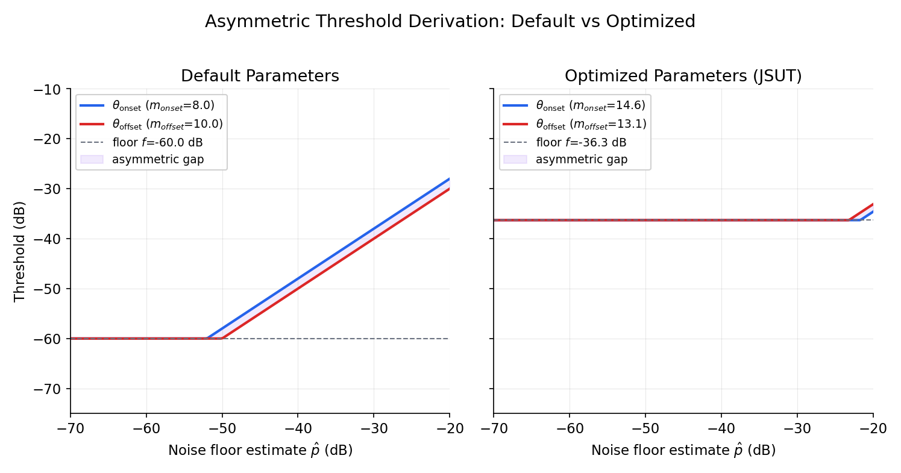
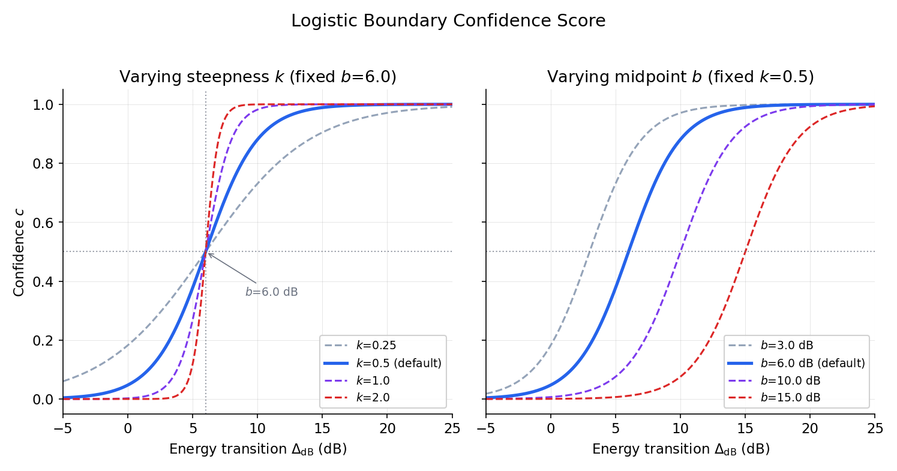
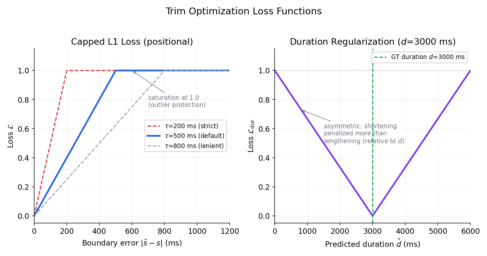

# Trim Detection Optimizer

Finds where speech begins and ends in an audio file. Produces exactly two points per utterance: `trim_start_ms` and `trim_end_ms`.

## Audio Energy Primer

This document uses **dBFS** (decibels relative to full scale) to describe audio energy levels. In dBFS, 0 dB is the loudest possible digital signal (clipping threshold) and all real audio levels are negative:

| Level | Typical source |
|-------|----------------|
| $0$ dB | Digital clipping (maximum) |
| $-10$ to $-6$ dB | Loud speech peaks |
| $-25$ to $-15$ dB | Normal conversational speech |
| $-45$ to $-35$ dB | Quiet room tone, ambient noise |
| $-60$ dB | Consumer equipment noise floor |
| $-80$ dB | Near-digital silence |

A **positive energy transition** ($\Delta_{\text{dB}} > 0$) means moving from a quieter region to a louder one — typically silence into speech. A **negative transition** ($\Delta_{\text{dB}} < 0$) means the opposite — speech decaying into silence, or a misplaced boundary where the "speech side" is actually quieter. The magnitude of the transition indicates sharpness: a 15 dB jump is an unambiguous onset, while a 3 dB drift could be room noise fluctuation.

All threshold and floor parameters in this document are expressed in dBFS. Their negative ranges reflect the fact that speech and noise both sit below 0 dB.

## Problem

Raw audio recordings contain leading/trailing silence, breath sounds, room noise, and mic artifacts before and after the actual speech content. These regions confuse downstream pause detection and waste model capacity during training. We need a robust, parameterized boundary detector that can be optimized against labeled ground truth.

## Detection Algorithm

### Asymmetric Threshold Derivation

The detector computes separate thresholds for speech onset and offset from a shared noise floor estimate:

$$
\hat{p} = \text{quantile}(\mathbf{r}, \; q / 100)
$$

$$
\theta_{\text{onset}} = \max\!\bigl(f, \; \hat{p} - m_{\text{onset}}\bigr)
$$

$$
\theta_{\text{offset}} = \max\!\bigl(f, \; \hat{p} - m_{\text{offset}}\bigr)
$$

where:
- $\mathbf{r} \in \mathbb{R}^T$ — RMS energy in dB per frame (sliding window)
- $q$ — noise floor percentile (bounds: $[5, 30]$, default: $10$). The 10th percentile captures the noise floor without being influenced by speech frames. Lower values ($\sim$5) risk measuring only mic self-noise; higher values ($\sim$30) start including low-energy speech.
- $f$ — absolute floor in dB (bounds: $[-80, -35]$, default: $-60$). Roughly the noise floor of consumer recording equipment — below this, you're in quantization noise territory. The optimizer learned $-36.3$ for JSUT, indicating higher ambient noise in that studio.
- $m_{\text{onset}}$ — onset margin in dB (bounds: $[2, 20]$, default: $8$). Speech onset is typically abrupt, so a modest margin above the noise floor suffices. Too low triggers on room noise; too high misses soft consonant onsets.
- $m_{\text{offset}}$ — offset margin in dB (bounds: $[2, 25]$, default: $10$). Wider than onset because speech tails decay gradually through trailing consonants, breath, and room reverb. The wider search space ($[2, 25]$ vs $[2, 20]$) reflects this asymmetry.

Asymmetric thresholds are necessary because speech onsets are typically sharp (silence → voice) while offsets are often gradual (voice → breath → room noise decay).



### Boundary Confidence Score

At each detected boundary, a logistic function measures the sharpness of the energy transition:

$$
\Delta_{\text{dB}} = \bar{r}_{\text{inside}} - \bar{r}_{\text{outside}}
$$

$$
c = \frac{1}{1 + \exp\!\bigl(-k \cdot (\Delta_{\text{dB}} - b)\bigr)}
$$

where:
- $\bar{r}_{\text{inside}}$ — mean RMS (dB) in a small window on the speech side of the boundary
- $\bar{r}_{\text{outside}}$ — mean RMS (dB) in a small window on the silence side
- $k = 0.5$ — logistic steepness. Controls how quickly confidence transitions from 0 to 1. At $k=0.5$ the curve is moderate — neither too binary (which would lose resolution) nor too flat (which would make all boundaries look similar). See left panel below.
- $b = 6.0$ — logistic midpoint (dB transition required for 50% confidence). A 6 dB energy jump corresponds to roughly 4x power. Sharp speech onsets typically show 10–20 dB transitions (high confidence), while gradual breath-to-speech ramps show 3–5 dB (low confidence). See right panel below.
- $c \in [0, 1]$ — confidence score



Sharp onset (speech jumps from silence) → high $c$. Gradual onset (breath, room noise ramp) → low $c$. This enables active learning: prioritize low-confidence trims for manual review.

**Design note:** $k$ and $b$ are fixed constants — they are *not* part of the 7-parameter optimization. The confidence score is a standalone heuristic that measures energy contrast at the boundary, independent of the loss function. It does not learn from ground truth; it simply asks "how sharp is this transition?" using a fixed logistic centered at $b = 6$ dB. This midpoint is somewhat arbitrary and speaker-dependent — a soft-spoken speaker may produce consistently lower $\Delta_{\text{dB}}$ values at legitimate boundaries, biasing their confidence scores downward. For the current use case (ranking boundaries for manual review), this heuristic is sufficient. A calibrated confidence would require including $k$ and $b$ in the optimization or training a separate boundary classifier against labeled data.

### Detection Pseudocode

> **Vectorization note:** The pseudocode below uses for loops for clarity. The production implementation (`audio.py`) currently uses scalar loops with `.item()` extraction. Steps 1, 5, and 6 are vectorizable: RMS computation via `torch.unfold()`, forward/backward scans via `torch.nonzero()`. The boundary confidence computation (step 11) already uses vectorized slice operations.

```python
def detect_trim_region(waveform, sr, config):
    # 1. Compute frame-level RMS energy
    rms_db = compute_rms_db(waveform, sr, config.window_ms, config.hop_ms)
    duration_ms = len(waveform) / sr * 1000

    # 2. Early exit: audio too short
    if duration_ms < config.min_content_ms:
        return 0, duration_ms, {"fallback": True, "reason": "audio_too_short"}

    # 3. Noise floor estimation
    percentile_db = quantile(rms_db, config.percentile / 100)

    # 4. Asymmetric thresholds
    onset_thresh  = max(config.floor_db, percentile_db - config.onset_margin_db)
    offset_thresh = max(config.floor_db, percentile_db - config.offset_margin_db)

    # 5. Forward scan: first frame above onset threshold
    onset_frame = None
    for i in range(len(rms_db)):
        if rms_db[i] >= onset_thresh:
            onset_frame = i
            break

    # 6. Backward scan: last frame above offset threshold
    offset_frame = None
    for i in range(len(rms_db) - 1, -1, -1):
        if rms_db[i] >= offset_thresh:
            offset_frame = i
            break

    # 7. No content detected
    if onset_frame is None or offset_frame is None:
        return 0, duration_ms, {"fallback": True, "reason": "no_content_detected"}

    # 8. Convert to ms with asymmetric outward padding
    trim_start = onset_frame * config.hop_ms - config.pad_start_ms
    trim_end   = (offset_frame + 1) * config.hop_ms + config.pad_end_ms

    # 9. Clamp to valid range
    trim_start = clamp(trim_start, 0, duration_ms)
    trim_end   = clamp(trim_end,   0, duration_ms)

    # 10. Validity check
    if trim_end <= trim_start or (trim_end - trim_start) < config.min_content_ms:
        reason = "inverted" if trim_end <= trim_start else "min_content"
        return 0, duration_ms, {"fallback": True, "reason": reason}

    # 11. Confidence scores
    conf_start = boundary_confidence(rms_db, onset_frame,  direction="onset")
    conf_end   = boundary_confidence(rms_db, offset_frame, direction="offset")

    return trim_start, trim_end, {
        "fallback": False,
        "confidence_start": conf_start,
        "confidence_end": conf_end,
    }
```

### Fallback Conditions

| Condition | Reason | Output |
|-----------|--------|--------|
| Audio shorter than `min_content_ms` | `audio_too_short` | Full audio |
| No frame above threshold | `no_content_detected` | Full audio |
| End ≤ start after padding | `inverted` | Full audio |
| Content window below `min_content_ms` | `min_content` | Full audio |

## Optimization

### Loss Function

Per-utterance capped L1 loss with duration regularization and fallback penalty:

$$
\mathcal{L}_{\text{start}} = \min\!\left(\frac{|\hat{s} - s|}{\tau}, \; 1\right)
$$

$$
\mathcal{L}_{\text{end}} = \min\!\left(\frac{|\hat{e} - e|}{\tau}, \; 1\right)
$$

$$
\mathcal{L}_{\text{dur}} = \min\!\left(\frac{|\hat{d} - d|}{d + \varepsilon}, \; 1\right)
$$

$$
\ell_u = \alpha_s \, \mathcal{L}_{\text{start}} + \alpha_e \, \mathcal{L}_{\text{end}} + \lambda_d \, \mathcal{L}_{\text{dur}}
$$

where:
- $s, e$ — ground truth trim start/end (ms)
- $\hat{s}, \hat{e}$ — predicted trim start/end (ms)
- $d = e - s$, $\hat{d} = \hat{e} - \hat{s}$ — ground truth and predicted content duration
- $\tau$ — tolerance window (default: $500$ ms), caps individual errors at $1.0$
- $\alpha_s, \alpha_e$ — positional weights (default: $1.0$)
- $\lambda_d$ — duration weight (default: $0.5$)
- $\varepsilon = 10^{-8}$ — numerical stability

Aggregated over the dataset with fallback penalty:

$$
\mathcal{L} = \frac{1}{N} \sum_{u=1}^{N} \ell_u \;+\; \lambda_f \cdot \frac{N_{\text{fallback}}}{N}
$$

where:
- $N$ — number of evaluated utterances
- $N_{\text{fallback}}$ — number of utterances where detection fell back to full audio
- $\lambda_f$ — fallback penalty weight (default: $0.1$)

The fallback penalty prevents the optimizer from discovering configs that "win" by producing degenerate trims that trigger full-audio fallback (hiding boundary errors).



### Optimizer Pseudocode

```python
def optimize_trim(dataset, n_folds=3, max_iter=50, seed=42):
    # Load ground truth labels with trim_start_ms and trim_end_ms
    labels = load_published_labels(dataset)
    labels = [l for l in labels if l.trim_start_ms is not None
                                and l.trim_end_ms is not None]

    # Preload audio into memory
    audio = {l.utterance_id: load_waveform(l) for l in labels}

    # Evaluate baseline (default TrimDetectionConfig)
    baseline = evaluate_trim_config(TrimDetectionConfig(), labels, audio)

    # 7-parameter search space
    bounds = [
        (2.0, 20.0),    # onset_margin_db
        (2.0, 25.0),    # offset_margin_db
        (-80.0, -35.0), # floor_db
        (5.0, 30.0),    # percentile
        (150, 1200),     # min_content_ms
        (0, 150),        # pad_start_ms
        (0, 250),        # pad_end_ms
    ]

    # K-fold cross-validation objective
    folds = stratified_partition(labels, k=n_folds, seed=seed)

    def objective(params):
        config = params_to_trim_config(params)
        losses = []
        for fold in folds:
            loss = evaluate_trim_config(config, fold, audio)
            losses.append(loss.total_loss)
        return mean(losses)

    # Differential evolution
    result = differential_evolution(objective, bounds, maxiter=max_iter, seed=seed)
    best_config = params_to_trim_config(result.x)

    # Cache predictions over full corpus
    run_trim_heuristic(dataset, best_config)

    return best_config, baseline, result
```

### Parameter Space

| Parameter | Bounds | Default | Purpose |
|-----------|--------|---------|---------|
| `onset_margin_db` | $[2, 20]$ | $8.0$ | Onset detection sensitivity |
| `offset_margin_db` | $[2, 25]$ | $10.0$ | Offset detection sensitivity (wider — tails are noisier) |
| `floor_db` | $[-80, -35]$ | $-60.0$ | Absolute energy floor |
| `percentile` | $[5, 30]$ | $10.0$ | Noise floor estimation percentile |
| `min_content_ms` | $[150, 1200]$ | $500$ | Minimum valid content duration |
| `pad_start_ms` | $[0, 150]$ | $30$ | Outward padding at onset |
| `pad_end_ms` | $[0, 250]$ | $50$ | Outward padding at offset |

## Results (JSUT, 39 labeled utterances)

| Metric | Baseline | Optimized | Improvement |
|--------|----------|-----------|-------------|
| Loss | 0.740 | 0.227 | 69.3% |
| MAE start | 242.8 ms | 63.7 ms | 73.8% |
| MAE end | 137.0 ms | 42.9 ms | 68.7% |
| Fallback rate | 0% | 0% | — |

Confidence stratification: 35/39 high-confidence (MAE 63/41 ms), 4/39 low-confidence (MAE 69/58 ms).

### Learned Parameters

| Parameter | Default | Optimized |
|-----------|---------|-----------|
| `onset_margin_db` | 8.0 | 14.6 |
| `offset_margin_db` | 10.0 | 13.1 |
| `floor_db` | -60.0 | -36.3 |
| `percentile` | 10.0 | 15.3 |
| `min_content_ms` | 500 | 181 |
| `pad_start_ms` | 30 | 45 |
| `pad_end_ms` | 50 | 210 |

**Observation — the asymmetry shifted domains.** The optimized $m_{\text{onset}} = 14.6$ is *larger* than $m_{\text{offset}} = 13.1$, which contradicts the design expectation that offsets need wider margins. This is because the high floor ($f = -36.3$ dB) dominates: for JSUT's clean studio recordings with a typical noise floor around $-45$ dB, both $\hat{p} - m_{\text{onset}}$ and $\hat{p} - m_{\text{offset}}$ fall well below $f$, so both thresholds clamp to $-36.3$ dB. The margins are effectively "don't care" parameters, and the 14.6 vs 13.1 difference is DE search noise.

The optimizer moved the onset/offset asymmetry into the **padding domain** instead: `pad_start_ms=45` vs `pad_end_ms=210`. For this dataset, the distinction between speech start and speech end is not about detection sensitivity — it's about how much context to preserve around the boundary. The 210 ms end padding confirms that Japanese speech tails need generous padding (breath, sentence-final particles like よ/ね, and room reverb decay).

## Output

Trim predictions cached as JSONL: `runs/labeling/heuristics/{dataset}_trim_{params_hash}.jsonl`

Per-utterance record:
```json
{
  "utterance_id": "...",
  "trim_start_ms": 120,
  "trim_end_ms": 4530,
  "confidence_start": 0.92,
  "confidence_end": 0.78,
  "fallback_to_full_audio": false,
  "fallback_reason": null,
  "duration_ms": 4800,
  "method": "trim_v1_adaptive",
  "params_hash": "34fe73aa6664"
}
```

## Source Files

- `modules/data_engineering/common/audio.py` — `TrimDetectionConfig`, `detect_trim_region()`, `_compute_boundary_confidence()`
- `modules/labeler/heuristic.py` — `optimize_trim()`, `_compute_trim_loss_utterance()`, `_evaluate_trim_config()`, `run_trim_heuristic()`
