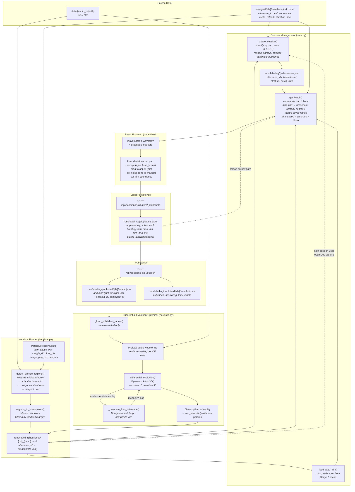
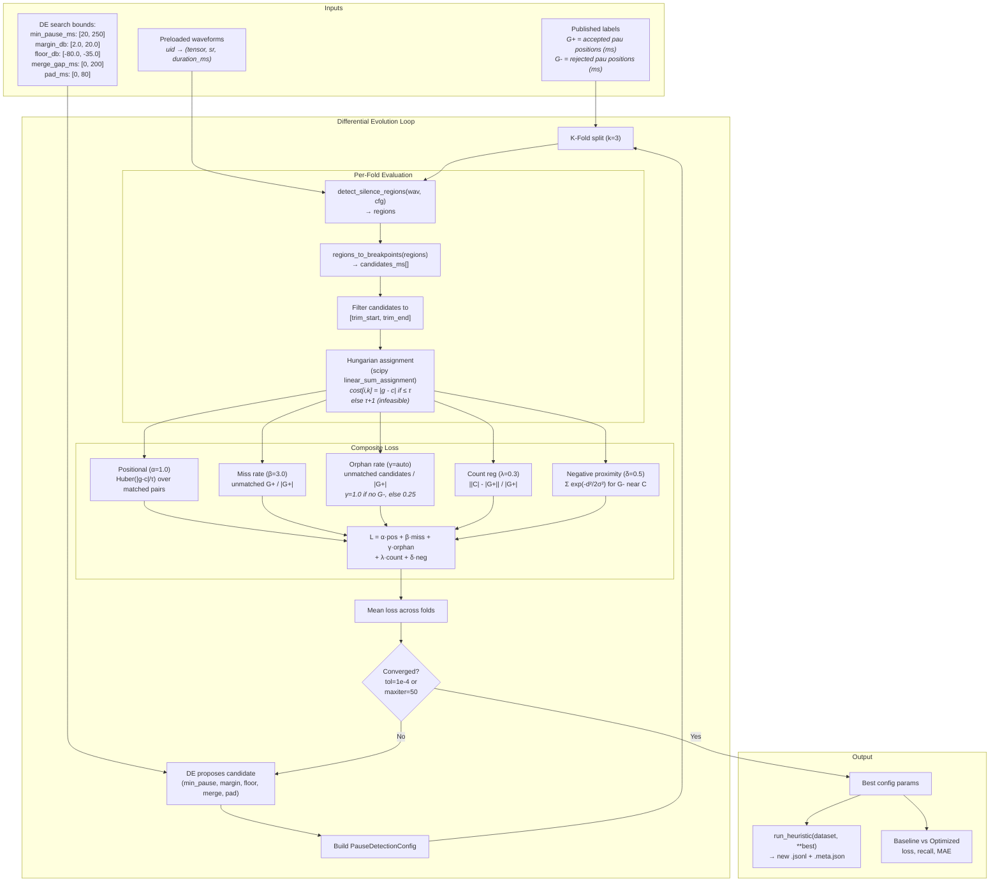
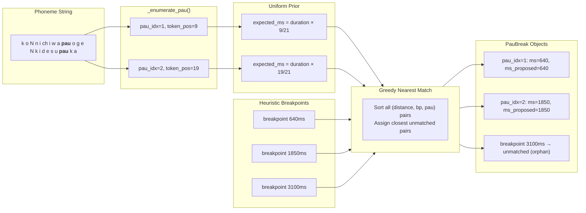
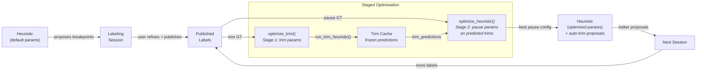

# Labeler Architecture: Data Storage & Optimization

## 1. Storage Locations

```
runs/labeling/
  {session_id}/
    session.json              # Session metadata (dataset, stratum, utterance_ids, heuristic ref)
    labels.jsonl              # Append-only user annotations (last-write-wins per utterance_id)

  published/{dataset}/
    labels.jsonl              # Canonical ground truth (deduped, with session_id provenance)
    manifest.json             # Published session registry + total_labels counter

  heuristics/
    {dataset}_{params_hash}.jsonl       # Per-utterance breakpoints cache (pause)
    {dataset}_{params_hash}.meta.json   # Config snapshot + run stats (pause)
    {dataset}_trim_{params_hash}.jsonl  # Per-utterance trim predictions cache
    {dataset}_trim_{params_hash}.meta.json  # Trim config snapshot + run stats

lake/silver/{dataset}/
  segment_breaks/             # Delta table (fallback if no heuristic JSONL)

lake/gold/{dataset}/
  manifests/train.jsonl       # Source utterances (text, phonemes, audio_relpath, duration_sec)

Browser localStorage:
  koe-labeler:{session_id}    # Transient UI recovery (survives browser crash, not canonical)
                              # Stores: currentIdx, pauBreaksMap, trimMap, savedIndices
```

> **Known gap:** `noise_zone_ms` is accepted by the `PauBreakSave` API model but
> dropped in `backend.py:315-323` when constructing the dict for persistence.
> Noise zone state currently only survives in localStorage, not in `labels.jsonl`.

## 2. End-to-End Data Flow



## 3. Label Schema v1 (per utterance)

```json
{
    "utterance_id": "JSUT_0042",
    "breaks": [
        {
            "pau_idx": 1,
            "token_position": 8,
            "ms_proposed": 630,
            "ms": 680,
            "delta_ms": 50,
            "use_break": true,
            "noise_zone_ms": 750
        },
        {
            "pau_idx": 2,
            "token_position": 14,
            "ms_proposed": 1200,
            "ms": 1200,
            "delta_ms": 0,
            "use_break": false,
            "noise_zone_ms": null
        }
    ],
    "trim_start_ms": 100,
    "trim_end_ms": 4500,
    "label_schema_version": 1,
    "heuristic_version": "pau_v1_adaptive",
    "heuristic_params_hash": "sha1:abc123",
    "sample_rate": 22050,
    "labeled_at": "2026-02-05T10:30:00+00:00",
    "status": "labeled"
}
```

Every pau is recorded (both `use_break=true` and `false`) so negative labels feed the optimizer.

## 4. Staged Optimization Pipeline

> **Implementation:** `detect_trim_region()` in `audio.py`; `optimize_trim()`, `run_trim_heuristic()`, `load_trim_cache()` in `heuristic.py`; trim-aware `_evaluate_config()` and `optimize_heuristic()` in `heuristic.py`; `load_auto_trim()` and auto-trim seeding in `data.py`. Design rationale in `staged-trim-pause-optimizer-rfc.md`.

The optimization is split into two cascaded stages to eliminate the train/inference distribution mismatch:

```mermaid
flowchart TD
    subgraph Stage1[\"Stage 1: Trim Detection\"]
        T1[\"Full audio waveform\"]
        T2[\"detect_trim_region()<br/><i>RMS onset/offset detection<br/>asymmetric thresholds</i>\"]
        T3[\"Predicted trim: ŝ, ê<br/><i>Always 2 points</i>\"]
        T4[\"Clamp + validity check<br/><i>ê-ŝ ≥ min_content_ms<br/>else fallback to full audio</i>\"]
        T1 --> T2 --> T3 --> T4
    end

    subgraph Optimize1[\"optimize_trim()\"]
        O1[\"Published labels with<br/>trim_start_ms, trim_end_ms\"]
        O2[\"DE search: onset_margin_db,<br/>offset_margin_db, floor_db,<br/>percentile, min_content_ms,<br/>pad_start_ms, pad_end_ms\"]
        O3[\"Loss: capped position error<br/>+ duration error<br/>+ fallback penalty\"]
        O4[\"Freeze best T*\"]
        O1 --> O2 --> O3 --> O4
    end

    subgraph Cache[\"Trim Predictions Cache\"]
        C1[\"run_trim_heuristic()<br/>→ {uid → (ŝ, ê)}.jsonl\"]
    end

    subgraph Stage2[\"Stage 2: Pause Detection\"]
        P1[\"Candidates within [ŝ-m, ê+m]<br/><i>m = slack band (200ms)</i>\"]
        P2[\"GT filtered to same window\"]
        P3[\"Hungarian matching + loss\"]
        P4[\"If trim invalid:<br/>full audio, no GT filter\"]
    end

    subgraph Optimize2[\"optimize_heuristic()\"]
        H1[\"Published labels with<br/>breaks[].ms, breaks[].use_break\"]
        H2[\"Pre-load trim predictions<br/>(frozen, not recomputed)\"]
        H3[\"DE search: min_pause_ms,<br/>margin_db, floor_db,<br/>merge_gap_ms, pad_ms\"]
        H4[\"Loss: positional + miss<br/>+ orphan + count + neg\"]
    end

    T4 --> C1
    O4 --> C1
    C1 --> H2
    H2 --> P1 & P2
    P1 --> P3
    P2 --> P3
    P4 -.-> P3
    H1 --> H3 --> H4
    P3 --> H4
```

### Training Order (No Circular Dependency)

1. `optimize_trim(dataset)` → freeze best `TrimDetectionConfig` T*
2. `run_trim_heuristic(dataset, **T*)` → cache predicted trims as JSONL artifact
3. `optimize_heuristic(dataset, trim_predictions=cached, trim_margin_ms=200)` → pause optimizer trains on Stage 1 output

### Inference (No Slack by Default)

1. `detect_trim_region(wav, T*)` → [ŝ, ê] (clamped)
2. `detect_silence_regions(wav, P*)` → breakpoints, filtered to [ŝ, ê]

### Key Design Decisions

| Decision | Rationale |
|----------|-----------|
| **Separate stages** | Trim (2-point boundary) and pause (N-point interior) have different signal regimes |
| **Train on predicted trims** | Matches inference distribution; avoids user-GT-as-window circular dependency |
| **Slack band (200ms)** | Absorbs small Stage 1 boundary drift during training |
| **Fallback penalty** | Discourages configs that trigger frequent clamping |
| **Decoupled safety constant** | `MIN_TRIM_WINDOW_MS_FOR_PAUSE=200` is Stage 2's own guardrail |

## 5. Original Single-Stage Optimization (Legacy)

> **Note:** This section documents the original single-stage approach, preserved for reference.
> The staged pipeline (Section 4) supersedes this for new optimization runs.

## 6. Single-Stage Optimization Detail (Legacy)



### Loss Function Breakdown

| Term | Weight | Formula | Purpose |
|------|--------|---------|---------|
| **Positional** | α=1.0 | `(1/\|M\|) Σ Huber(\|g-c\|/τ)` | Penalize misaligned matched pairs. Huber is quadratic near 0, linear for outliers (robust). |
| **Miss rate** | β=3.0 | `\|unmatched G+\| / \|G+\|` | Heavy penalty for failing to detect user-accepted pauses. |
| **Orphan rate** | γ=auto | `\|unmatched C\| / \|G+\|` | Penalize proposing breaks where user didn't accept. Auto-schedules: γ=1.0 when no G- data, γ=0.25 otherwise. |
| **Count reg** | λ=0.3 | `\|\|C\| - \|G+\|\| / \|G+\|` | Regularize candidate count toward ground truth count. |
| **Neg proximity** | δ=0.5 | `(1/\|G-\|) Σ exp(-d²/2σ²)` | Gaussian penalty when candidates land near rejected pau positions. σ=τ/2. |

**τ (tau)** = 120ms matching radius. Pairs beyond this distance are infeasible in the cost matrix.

## 7. Pau-to-Breakpoint Mapping



## 8. Feedback Loop (Staged)



Each cycle: more labels → better trim fit → better pause fit → better proposals → less user effort per utterance.
Training order: Stage 1 (trim) freezes first, Stage 2 (pause) trains on Stage 1 predictions with slack band.
`optimize_heuristic()` supports legacy mode (`trim_predictions=None`) for backward compatibility.

**Auto-trim seeding:** `get_batch()` calls `load_auto_trim()` to seed `trim_start_ms`/`trim_end_ms` from the Stage 1 cache for utterances without saved trims. Precedence: saved trims > auto-trim > None. Trims are clamped and validated before reaching the UI.

## 9. What's NOT Built Yet

The path from **published labels → training pipeline** is not yet implemented. The published labels sit at `runs/labeling/published/{ds}/labels.jsonl` but nothing currently:
- Merges them into silver/gold Delta tables
- Creates "Tier 2" labeled segments for training
- Updates the training dataset with segment-level phoneme alignment

This is the bridge between the labeling app and the training pipeline that would close the loop for supervised segment training.
