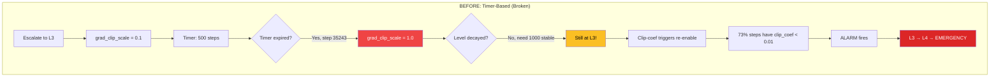
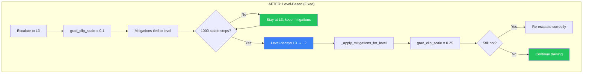
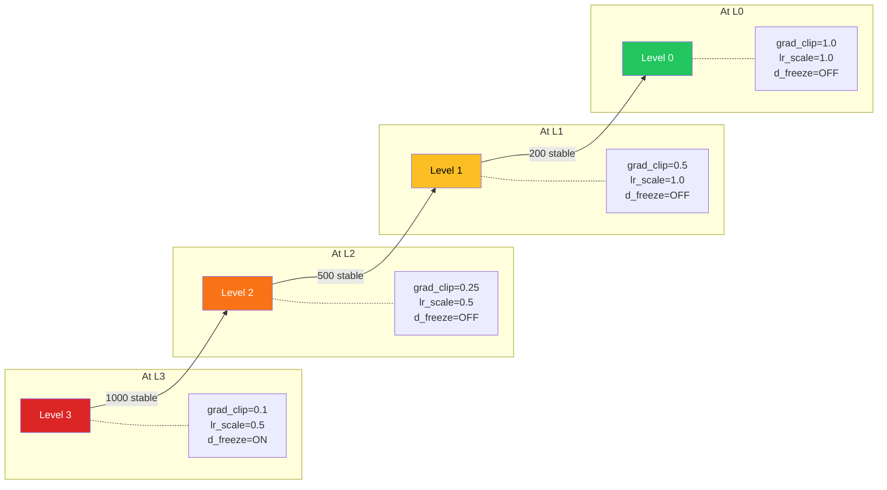

# Postmortem: Mitigation Expiry Gap Emergency

**Run ID:** `multi_vits_gan_20260129_212937`
**Date:** 2026-01-30
**Incident Type:** `controller_design_flaw`
**Outcome:** Emergency stop at step 35,342 with improving mel loss

---

## Summary

Training was emergency-stopped at step 35,342 despite **improving mel loss** (1.21 → 1.06, -5.2%) and **stable gradient metrics**. The root cause was a design flaw: escalation mitigations (grad_clip, lr_scale, d_freeze) expired on fixed 500-step timers, while escalation level decay required 1000 stable steps. This created a gap where the level persisted but mitigations were inactive, allowing triggers to re-fire immediately.

---

## Timeline

| Step | Event | Metrics |
|------|-------|---------|
| 30,904 | First instability in 30k+ region | EMA_G elevated |
| 30,904–33,834 | Oscillating healthy↔unstable | 8 state transitions |
| 34,743 | Escalate to L3 | `grad_clip_scale = 0.1`, `d_freeze = true` |
| 35,243 | **Mitigation timer expired** | `grad_clip_scale → 1.0` (500 steps elapsed) |
| 35,243 | Still at L3 | Needed 1000 stable steps, only had 500 |
| 35,243+ | Clip-coef triggers re-enabled | 73% of steps had clip_coef < 0.01 |
| 35,293+ | Clip-coef alarm fires | Within escalation memory (2000 steps) |
| **35,342** | **EMERGENCY STOP** | L3 → L4, mel_loss = 1.06 (improving!) |

---

## Root Cause Analysis

### The Timer vs Level Mismatch





### Why This Happens

The mitigations and escalation level were on **independent timers**:

```python
# When escalating to L3:
self.state.escalation_level = 3
self.state.grad_clip_tighten_until = step + 500  # Timer: 500 steps
self.state.d_freeze_until = step + 500           # Timer: 500 steps

# But de-escalation requires:
stability_required_steps_l3 = 1000  # Need 1000 stable steps!
```

After 500 steps, mitigations expired but we were still at L3 (only 500 of 1000 stable steps). With `grad_clip_scale = 1.0`, the clip-coef triggers re-enabled and fired immediately because the 30k+ regime naturally runs hot (median clip_coef = 0.006).

### The 30k+ Regime

| Metric | Documented Normal | Actual (30k-35k) |
|--------|-------------------|------------------|
| g_grad_norm median | 20-40 | **46.6** |
| g_clip_coef median | 0.03-0.07 | **0.006** |
| Steps with grad > 40 | rare | **61%** |

The gradient regime at 30k+ is naturally hotter than the 15k-20k baseline where thresholds were calibrated.

---

## Evidence

### Healthy Metrics at Emergency Stop

```json
{
  "step": 35342,
  "mel_loss": 1.0614,
  "g_grad_norm": 37.2,
  "d_grad_norm": 18.5,
  "ema_grad_g": 76.5,
  "ema_grad_d": 18.5,
  "ctrl_escalation_level": 3,
  "ctrl_grad_clip_scale": 1.0,
  "ctrl_spike_density": 0,
  "ctrl_ema_elevated_steps_g": 0
}
```

Key observations:
- `mel_loss = 1.06` — **improved** from 1.21 at step 30k
- `ema_grad_g = 76.5` — elevated but **well below** soft limit (2000) and EMA alarm (500)
- `spike_density = 0` — **no spikes**
- `grad_clip_scale = 1.0` — **mitigation had expired** despite L3

### grad_clip_scale Transitions

```
Step 34,743: grad_clip_scale = 0.1 (L3 mitigation applied)
Step 35,243: grad_clip_scale = 1.0 (timer expired!)
Step 35,342: Still L3, no protection → clip-coef triggered → L4 → EMERGENCY
```

---

## Bug Report

### Before: Timer-Based Mitigation Expiry

```python
# In _trigger_alarm() when escalating:
if self.state.escalation_level >= 1:
    self.state.grad_clip_tighten_active = True
    self.state.grad_clip_tighten_until = step + self.config.grad_clip_tighten_duration  # Fixed timer!
    clip_idx = min(self.state.escalation_level - 1, len(self.config.grad_clip_scales) - 1)
    self.state.grad_clip_scale = self.config.grad_clip_scales[clip_idx]

# In _decay_mitigations():
if self.state.grad_clip_tighten_active and step >= self.state.grad_clip_tighten_until:
    self.state.grad_clip_tighten_active = False
    self.state.grad_clip_scale = 1.0  # Mitigation expires, but level persists!
```

**Problem:** Mitigation expires after 500 steps, but level needs 1000 stable steps to decay. Gap allows triggers to re-fire.

---

## Fix Applied (2026-01-30)

**Solution:** Tie mitigations directly to escalation level, not timers. Mitigations only change when the level changes.

### New Method: `_apply_mitigations_for_level()`

```python
def _apply_mitigations_for_level(self, step: int) -> None:
    """Apply mitigations based on current escalation level.

    Mitigations are tied directly to escalation level, not timers.
    When level changes (up or down), mitigations adjust accordingly.
    This prevents the gap where mitigations expire but level hasn't decayed.
    """
    level = self.state.escalation_level

    # Level 0: No mitigations
    if level == 0:
        self.state.grad_clip_tighten_active = False
        self.state.grad_clip_scale = 1.0
        self.state.lr_scale_active = False
        self.state.lr_scale = 1.0
        self.state.d_freeze_active = False
        # Clear clip_coef history to avoid stale values triggering alarms
        self._clip_coef_g_history.clear()
        self._clip_coef_d_history.clear()
        return

    # Level 1+: Tighten grad clipping
    self.state.grad_clip_tighten_active = True
    clip_idx = min(level - 1, len(self.config.grad_clip_scales) - 1)
    self.state.grad_clip_scale = self.config.grad_clip_scales[clip_idx]

    # Level 2+: Also reduce LR
    if level >= 2:
        self.state.lr_scale_active = True
        self.state.lr_scale = self.config.lr_scale_factor
    else:
        self.state.lr_scale_active = False
        self.state.lr_scale = 1.0

    # Level 3+: Also freeze D
    if level >= 3:
        self.state.d_freeze_active = True
        self.state.d_freeze_last_probe = step  # Reset probe timer
    else:
        self.state.d_freeze_active = False
        self.state.d_freeze_probe_active = False
```

### Updated `_trigger_alarm()` for Escalation

```python
# OLD: Set timer-based mitigation
if self.state.escalation_level >= 1:
    self.state.grad_clip_tighten_active = True
    self.state.grad_clip_tighten_until = step + self.config.grad_clip_tighten_duration
    # ... more timer setup

# NEW: Apply mitigations based on level
self._apply_mitigations_for_level(step)
```

### Updated `_decay_mitigations()` for De-escalation

```python
# OLD: Timer-based expiry
if self.state.grad_clip_tighten_active and step >= self.state.grad_clip_tighten_until:
    self.state.grad_clip_tighten_active = False
    self.state.grad_clip_scale = 1.0

# NEW: Level-based — only adjust when level decays
if self.state.escalation_level == 0:
    return  # Already at baseline

if not self._can_decay_level(step):
    return  # Stability requirements not met

# Decay exactly one level
self.state.escalation_level -= 1
self.state.level_entry_step = step
self.state.stable_steps_at_level = 0

# Apply mitigations for the new (lower) level
self._apply_mitigations_for_level(step)
```

### After: Level-Based Mitigations



**Key change:** Mitigations are now properties of the level, not independent timers. When level changes, `_apply_mitigations_for_level()` is called to adjust all mitigations atomically.

---

## Lessons Learned

1. **Mitigations must be coupled to the state they're mitigating.** Independent timers create gaps where the system is vulnerable.

2. **Test the full escalation → de-escalation cycle.** The timer mismatch (500 vs 1000) wasn't obvious until it caused an emergency.

3. **The 30k+ regime runs hotter than baseline.** Thresholds calibrated at 15k-20k (clip_coef median 0.05) are too aggressive for 30k+ (clip_coef median 0.006).

4. **Improving metrics don't prevent emergency stops.** Mel loss was down 5.2% but the controller only sees trigger conditions, not training progress.

---

## Action Items

- [x] Fix mitigation-level coupling in gan_controller.py — **Done 2026-01-30**
- [x] Add postmortem documentation — **Done 2026-01-30**
- [x] Update GAN_CONTROLLER.md with level-based mitigation note — **Done 2026-01-30**
- [ ] Add test: "mitigation persists until level decays"
- [ ] Add test: "de-escalation adjusts mitigations correctly"
- [ ] Consider 30k+ specific thresholds or adaptive calibration
- [ ] Validate fix with training run through 35k+

---

## Related

- [GAN Controller Reference](../training/GAN_CONTROLLER.md)
- [GAN Stability Log](./gan_stability_log.md)
- [Previous: Clip-coef Feedback Loop](./2026-01-30_multi_vits_gan_20260129_200158_clip_coef_feedback_loop.md)
