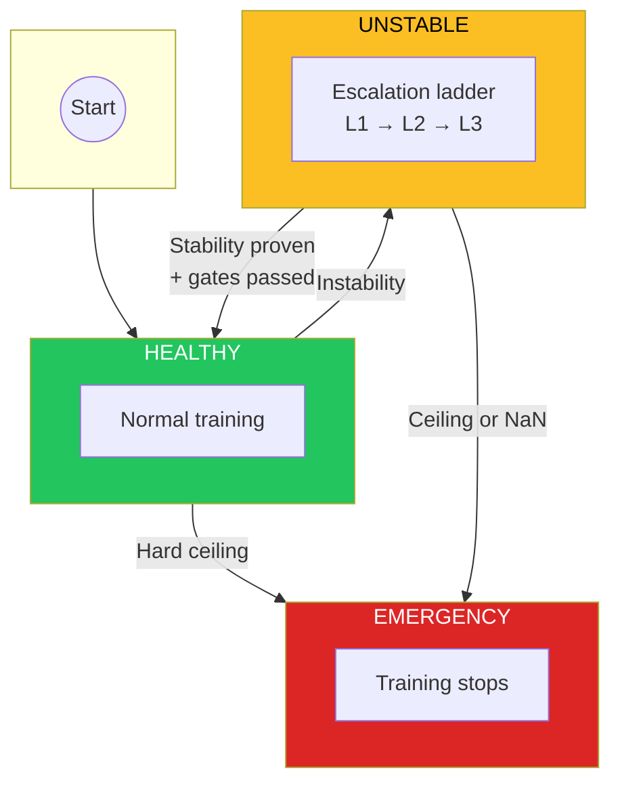
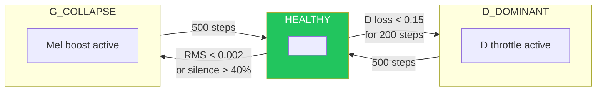
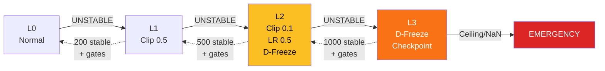
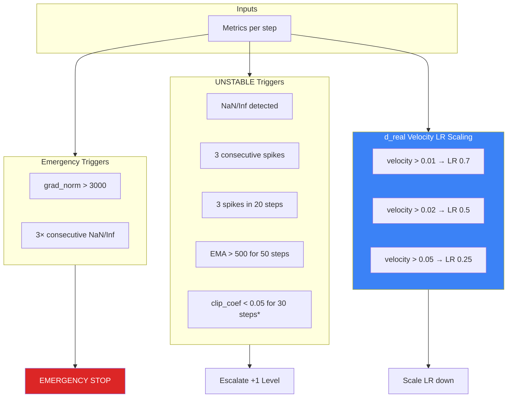
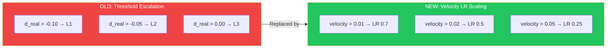
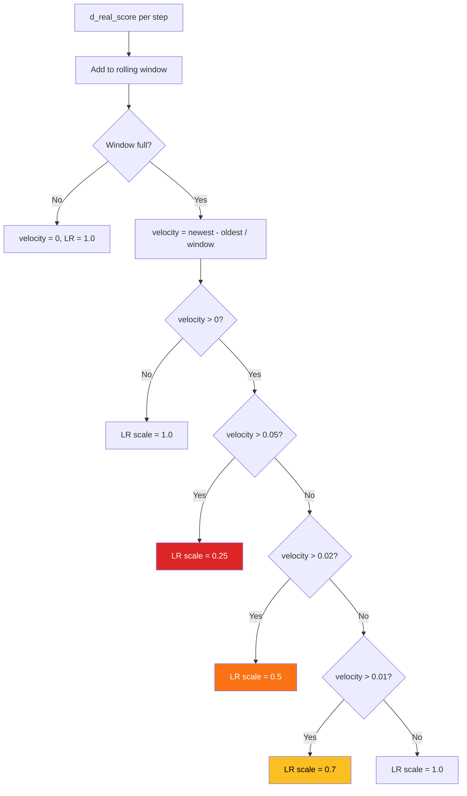
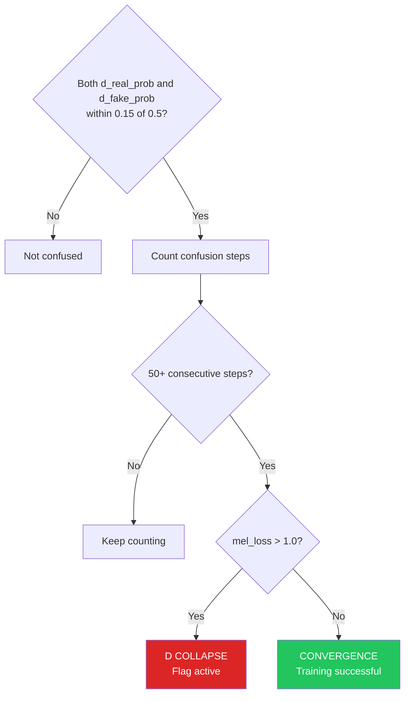
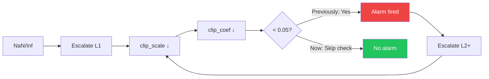
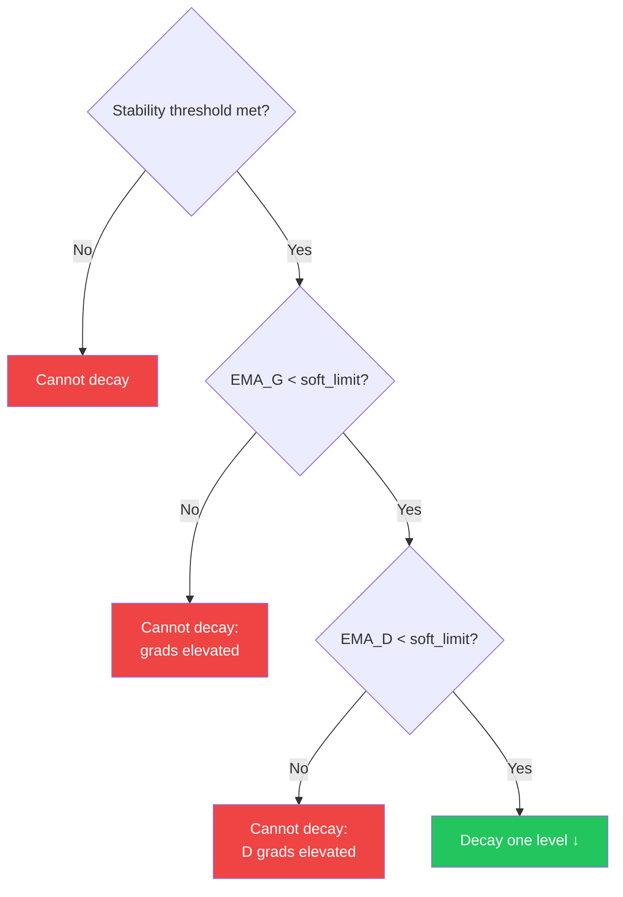

# GAN Controller Reference

The GAN controller monitors discriminator/generator health during VITS GAN training and applies automatic mitigations when it detects instability.

**Source:** `modules/training/common/gan_controller.py`

---

## State Machine Diagram



### Side States (Non-Escalating)

D_DOMINANT and G_COLLAPSE are **non-escalating** states. They apply targeted mitigations and return to HEALTHY when the mitigation expires. They do **not** lead to EMERGENCY.



| State | Mitigation | Duration | Effect |
|-------|------------|----------|--------|
| D_DOMINANT | D throttle | 500 steps | Update D every N steps instead of every step |
| G_COLLAPSE | Mel boost | 500 steps | Multiply mel weight by 1.1× |

### State Transitions Reference

| From | To | Trigger |
|------|----|---------|
| HEALTHY | UNSTABLE | NaN/Inf detected |
| HEALTHY | UNSTABLE | Consecutive grad spikes (3+) |
| HEALTHY | UNSTABLE | Spike density (3 in 20 steps) |
| HEALTHY | UNSTABLE | EMA elevated (>500 for 50 steps) |
| HEALTHY | UNSTABLE | Hard clipping (clip_coef < 0.05 for 30 steps)* |
| HEALTHY | D_DOMINANT | D loss < 0.15 for 200 steps |
| HEALTHY | G_COLLAPSE | RMS < 0.002 or silence > 40% |
| HEALTHY | EMERGENCY | grad_norm > 3000 (hard ceiling) |
| UNSTABLE | HEALTHY | Stability proven (see decay rules) |
| UNSTABLE | EMERGENCY | Max escalation (L4) reached |
| UNSTABLE | EMERGENCY | 3 consecutive NaN/Inf steps |
| UNSTABLE | EMERGENCY | grad_norm > 3000 |
| D_DOMINANT | HEALTHY | D loss recovers |
| G_COLLAPSE | HEALTHY | Output quality recovers |
| EMERGENCY | (stop) | Training terminates |

*Disabled when `grad_clip_scale < 1.0` (feedback loop fix)

---

## Escalation Ladder Diagram



### Escalation Level Details

| Level | grad_clip_scale | lr_scale | D Updates | Decay Requires |
|-------|-----------------|----------|-----------|----------------|
| 0 | 1.0 | 1.0 | Normal | — |
| 1 | 0.5 → 0.25 → 0.1 | 1.0 | Normal | 200 stable steps + gates |
| 2 | 0.1 | 0.5 | **FROZEN** | 500 stable steps + gates |
| 3 | 0.1 | 0.5 | **FROZEN** | 1000 stable steps + gates |

**Key changes (2026-02-01):**
- **D-freeze now starts at L2** (configurable via `d_freeze_start_level`)
- **Threshold-based d_real triggers removed** — replaced with velocity-based LR scaling (see below)
- **D scores normalized to (0,1)** — sigmoid transformation for intuitive interpretation

**Escalation triggers:**
- UNSTABLE alarm fires while already at a level (within 2000 steps of last alarm)
- Gradient spikes, EMA elevated, clip coefficient triggers

**Decay:** Dashed arrows. Requires sustained stability + de-escalation gates passed.

**Mitigations are tied to level:** As of 2026-01-30, mitigations (grad_clip, lr_scale, d_freeze) persist for the entire duration at a level. They only change when the level changes. See [mitigation expiry gap postmortem](../postmortems/2026-01-30_multi_vits_gan_20260129_212937_mitigation_expiry_gap.md).

---

## Detection Trigger Flow



*Clip-coef check is disabled when `grad_clip_scale < 1.0` (see fix below)

---

## D Score Normalization (2026-02-01)

Raw discriminator scores (d_real, d_fake) are unbounded real numbers that are difficult to interpret. The controller now normalizes them to **(0, 1) probabilities** using the sigmoid function:

```
d_real_prob = sigmoid(d_real_score)
d_fake_prob = sigmoid(d_fake_score)
```

### Interpretation

| Metric | Value | Meaning |
|--------|-------|---------|
| `d_real_prob` | > 0.5 | D correctly identifies real samples (GOOD) |
| `d_real_prob` | ≈ 0.5 | D uncertain about real samples |
| `d_real_prob` | < 0.5 | D thinks real is fake (BAD) |
| `d_fake_prob` | < 0.5 | D correctly identifies fake samples (GOOD) |
| `d_fake_prob` | ≈ 0.5 | D uncertain about fake samples |
| `d_fake_prob` | > 0.5 | D thinks fake is real (G fooling D) |

**Ideal training state:** `d_real_prob` high (>0.6), `d_fake_prob` low (<0.4) — D discriminates well.

**Convergence:** Both near 0.5 AND mel_loss low — G produces perfect samples.

**D Collapse:** Both near 0.5 AND mel_loss high — D has failed, no gradient signal.

---

## d_real Velocity-Based LR Scaling (2026-02-01)

**Philosophy change:** D improving (d_real rising toward positive) is **GOOD** — it means D is learning to distinguish real from fake. However, if D improves too fast, G can't keep up and gradients explode.

Instead of threshold-based level jumps (the old approach), we now use **velocity-based LR scaling** to allow smooth D improvement while preventing runaway.

### Why Velocity, Not Threshold?

The old threshold-based approach treated d_real > 0 as "inversion" requiring emergency response. But:
- D improving is the goal of GAN training
- Sudden jumps to L3 are disruptive
- What matters is *rate of change*, not absolute value



### Velocity Calculation

```python
velocity = (newest_d_real - oldest_d_real) / window_size
```

The velocity is calculated over a rolling window (default 20 steps). Only **rising** velocity (positive) triggers LR scaling — falling or stable d_real is fine.

### LR Scaling Tiers

| Velocity | LR Scale | Effect |
|----------|----------|--------|
| ≤ 0 | 1.0 | D falling or stable, no intervention |
| < 0.01 | 1.0 | Normal improvement pace |
| < 0.02 | 0.7 | Slight slowdown, D improving fast |
| < 0.05 | 0.5 | Moderate slowdown, D improving very fast |
| ≥ 0.05 | 0.25 | Strong slowdown, D racing ahead |

The LR scale has a floor of 0.1 to prevent complete stall.

### Detection Flow



### Configuration

```yaml
controller:
  # Velocity window
  d_real_velocity_window: 20

  # Velocity thresholds (change per step)
  d_real_velocity_warning: 0.01
  d_real_velocity_critical: 0.02
  d_real_velocity_emergency: 0.05

  # LR scales for each tier
  d_real_velocity_lr_scales: [0.7, 0.5, 0.25]

  # Floor to prevent complete stall
  d_real_velocity_lr_min: 0.1
```

---

## D Confusion Detection (2026-02-01)

D confusion occurs when both `d_real_prob` and `d_fake_prob` are near 0.5 — the discriminator can't tell real from fake. This can mean:

1. **D Collapse (BAD):** D has failed, G receives no gradient signal
2. **Convergence (GOOD):** G produces perfect samples, D correctly uncertain

We distinguish using `mel_loss`:



### Configuration

```yaml
controller:
  # Confusion threshold: |prob - 0.5| < this = confused
  d_confusion_threshold: 0.15

  # Steps of confusion before flagging
  d_confusion_steps: 50

  # Mel loss floor: only flag as collapse if mel_loss above this
  d_confusion_mel_floor: 1.0
```

### Metrics Logged

| Metric | Meaning |
|--------|---------|
| `d_confusion_steps` | Consecutive steps in confusion state |
| `d_confusion_active` | True if D collapse detected (bad confusion) |

---

## ✅ FIXED: Clip-Coef Feedback Loop (2026-01-30)

The clip coefficient trigger previously had a self-reinforcing bug where the controller's own mitigation (tighter clipping) would trigger further alarms.



**Fix:** Clip coefficient checks are now **disabled** when `grad_clip_scale < 1.0`. Low clip_coef is expected when clipping is intentionally tightened.

**Full postmortem:** [2026-01-30_multi_vits_gan_20260129_200158_clip_coef_feedback_loop.md](../postmortems/2026-01-30_multi_vits_gan_20260129_200158_clip_coef_feedback_loop.md)

### Root Cause

The `clip_coef` (ratio of clipped gradient to original gradient) naturally decreases when `grad_clip_scale` is reduced:

```
effective_clip = base_clip × grad_clip_scale
clip_coef = effective_clip / grad_norm

At L1: clip = 1.0 × 0.5 = 0.5  → clip_coef ≈ 0.5/20 = 0.025
At L2: clip = 1.0 × 0.25 = 0.25 → clip_coef ≈ 0.25/20 = 0.0125
At L3: clip = 1.0 × 0.1 = 0.1  → clip_coef ≈ 0.1/20 = 0.005
```

**The controller's own mitigation (tighter clipping) triggers the "hard clipping" alarm, causing further escalation.**

### Fix Required

The hard_clip detector should be **disabled** when `grad_clip_scale < 1.0`:

```python
# In _check_instability():
if self.state.grad_clip_scale < 1.0:
    # Don't count hard_clip_steps when we intentionally tightened clipping
    pass
else:
    if g_clip_coef < self.config.clip_coef_hard_threshold:
        self.state.hard_clip_steps_g += 1
        # ... trigger logic
```

Or normalize `clip_coef` by the current `grad_clip_scale`:

```python
effective_clip_coef = g_clip_coef / self.state.grad_clip_scale
if effective_clip_coef < self.config.clip_coef_hard_threshold:
    # ...
```

---

## Conditional Decay Requirements (De-escalation Gates)



### Decay Requirements by Level

| Transition | Stable Steps Required | + Gates |
|------------|----------------------|---------|
| L1 → L0 | 200 | EMA_G < soft_limit, EMA_D < soft_limit |
| L2 → L1 | 500 | EMA_G < soft_limit, EMA_D < soft_limit |
| L3 → L2 | 1000 | EMA_G < soft_limit, EMA_D < soft_limit |

### De-escalation Gates (2026-02-01)

**Note:** As of 2026-02-01, de-escalation no longer gates on d_real threshold. D improving (rising d_real) is now handled by velocity-based LR scaling, not by blocking de-escalation.

#### Soft Grad Limits

```yaml
controller:
  soft_grad_limit_g: 2000   # Default, can tighten to 200
  soft_grad_limit_d: 2000
```

- If `ema_grad_g > soft_grad_limit_g`, level cannot decay
- If `ema_grad_d > soft_grad_limit_d`, level cannot decay
- Prevents decay during "living dangerously" regimes
- Normal training: ema_grad_g ≈ 20-40, ema_grad_d ≈ 10-20

### Why No d_real Gate?

The old approach gated de-escalation on `d_real < -0.15` to ensure D recovery before releasing mitigations. This is now unnecessary because:

1. **D improving is good** — we want d_real to rise
2. **Velocity-based LR scaling** handles rapid D improvement
3. **Blocking de-escalation on d_real** prevented healthy recovery

Instead, D's health is now managed continuously via velocity tracking, not discrete gates.

---

## D Freeze Behavior (Level 2+)

D-freeze activates at escalation level 2 or above (configurable via `d_freeze_start_level`). When active, discriminator weight updates are skipped to let the generator stabilize without an adversary fighting back.

### Configuration

```yaml
controller:
  d_freeze_start_level: 2      # D-freeze at L2+ (was L3)
  d_unfreeze_warmup_steps: 50  # Steps before unfreezing after de-escalation
```

### During Freeze

| Metric | Value | Reason |
|--------|-------|--------|
| `d_freeze_active` | true | D updates skipped |
| `d_grad_norm` | 0 | No D backward pass |
| `ema_grad_d` | Decays → 0 | EMA of zeros |
| `d_real_score` | Still computed | Forward pass runs for monitoring |
| `d_fake_score` | Still computed | Forward pass runs for monitoring |

**Important:** D's forward pass still runs during freeze. We need the scores for:
1. G's adversarial loss (G still learns to fool D)
2. d_real monitoring (leading indicator)

### Probe Mechanism

Every 100 steps during freeze, D briefly unfreezes for 10 steps:

```yaml
controller:
  d_freeze_probe_interval: 100  # Probe every N steps
  d_freeze_probe_duration: 10   # Probe lasts N steps
```

**During probe:**
- D forward pass runs (always)
- D backward pass runs
- D optimizer step runs (weights update)
- `d_freeze_probe_active: true` in metrics

**Purpose:** Test if D can still discriminate. If d_real stays healthy during probe, unfreezing may be safe.

**Note:** Current implementation updates D weights during probe. Future versions may make probes forward-only.

### Automatic Checkpoint

When D-freeze **first activates** (not at every L3 transition), a `last_known_good` checkpoint is saved:

```
checkpoints/step_051140_last_known_good.pt
```

This provides a recovery point if the model cannot stabilize.

### Note on "Vanishing" D Gradients

When D is frozen, `d_grad_norm = 0` is **expected** (not a bug). The controller tracks this state. If you see d_grad_norm=0 with d_freeze_active=false, that would be a bug.

---

## Overview

GAN training is inherently unstable. The discriminator (D) and generator (G) are adversaries — if one dominates, training collapses. The controller watches for signs of trouble and intervenes automatically.

### Alarm Types

| Alarm | Symptom | Cause |
|-------|---------|-------|
| `D_DOMINANT` | D loss very low, G adv loss rising | D winning too easily |
| `G_COLLAPSE` | Low RMS, high silence in output | G producing garbage |
| `UNSTABLE` | Grad spikes, NaN/Inf, sustained clipping | Numeric instability |
| `EMERGENCY` | Hard ceiling exceeded, max escalation | Unrecoverable, must stop |

---

## Detection Triggers

### 1. Hard Ceiling (Emergency)

**What it catches:** Catastrophic gradient explosion.

```python
absolute_grad_limit_g: float = 3000.0
absolute_grad_limit_d: float = 3000.0
```

If `grad_norm_g > 3000` or `grad_norm_d > 3000`, training stops immediately. This is the last line of defense.

**Tuning:**
- Original value was 5000, lowered to 3000 after a run hit 5272
- Should be set high enough that normal training never hits it
- If you're hitting this, something is very wrong

---

### 2. NaN/Inf Detection (Emergency)

**What it catches:** Non-finite values in gradients or losses.

```python
nan_inf_max_consecutive: int = 3
```

Three consecutive steps with NaN/Inf triggers emergency stop.

**Tuning:** Generally don't change this. NaN means the math broke.

---

### 3. Consecutive Spike Detection (UNSTABLE)

**What it catches:** Sustained gradient spikes.

```python
consecutive_spikes_for_unstable: int = 3
grad_norm_spike_factor: float = 2.0
```

A "spike" is when `grad_norm > p99 * 2.0` (where p99 is computed over a rolling window). Three spikes in a row triggers UNSTABLE.

**Tuning:**
- This is the original trigger, fairly conservative
- Misses "bursty" patterns where spikes have recovery steps between them

---

### 4. Spike Density Detection (UNSTABLE)

**What it catches:** Bursty instability patterns.

```python
spike_density_window: int = 20
spike_density_threshold: int = 3
```

If 3+ spikes occur within any 20-step window, triggers UNSTABLE. This catches patterns like spike-ok-spike-ok-spike that consecutive detection misses.

**Tuning:**
- Added after consecutive detection missed a failure
- Can increase window or threshold if too sensitive

---

### 5. EMA Elevated Detection (UNSTABLE)

**What it catches:** Gradual gradient escalation.

```python
ema_elevated_limit_g: float = 500.0
ema_elevated_limit_d: float = 500.0
ema_elevated_steps_threshold: int = 50
grad_ema_alpha: float = 0.1
```

Tracks exponential moving average of gradient norms. If `ema_grad_g > 500` for 50 consecutive steps, triggers UNSTABLE.

**Tuning:**
- Catches "living dangerously" regimes where no single spike occurs but the average is climbing
- The EMA alpha (0.1) means it responds slowly to changes
- Increase `ema_elevated_limit` if normal training runs hot
- Increase `ema_elevated_steps_threshold` if it triggers too quickly

---

### 6. Clip Coefficient Detection (UNSTABLE)

**What it catches:** Sustained hard gradient clipping.

```python
clip_coef_hard_threshold: float = 0.05
clip_coef_hard_steps: int = 30
clip_coef_median_threshold: float = 0.1
clip_coef_median_window: int = 50
```

The clip coefficient is:
```
clip_coef = min(1.0, clip_value / grad_norm)
```

- `clip_coef = 1.0` means no clipping occurred
- `clip_coef = 0.5` means gradient was halved
- `clip_coef = 0.01` means 99% of the gradient was removed

**Two conditions (OR):**
1. `clip_coef < 0.05` for 30 consecutive steps → UNSTABLE
2. `median(clip_coef) < 0.1` over 50 steps → UNSTABLE

**Tuning:**
- This trigger is currently **too aggressive** (see Known Issues below)
- A clip_coef of 0.05 means grad_norm was 20x the clip value
- Normal GAN training can have sustained clipping during equilibrium-finding
- Consider raising `clip_coef_hard_threshold` to 0.02 or 0.01
- Consider increasing `clip_coef_hard_steps` to 50+

---

### 7. D Dominant Detection (D_DOMINANT)

**What it catches:** Discriminator winning too easily.

```python
d_loss_low_threshold: float = 0.15
g_loss_adv_high_threshold: float = 8.0
d_dominant_window: int = 200
```

If D loss stays below 0.15 for 200 steps AND G adversarial loss is above 8.0, triggers D_DOMINANT.

**Tuning:**
- This is a slow trigger (200 steps)
- If D is too strong, G can't learn meaningful gradients

---

### 8. G Collapse Detection (G_COLLAPSE)

**What it catches:** Generator producing silence/garbage.

```python
rms_low_threshold: float = 0.002
silence_high_threshold: float = 40.0  # percent
```

If predicted audio has RMS < 0.002 or >40% silence, triggers G_COLLAPSE.

**Tuning:** Requires `pred_rms` and `pred_silence_pct` to be passed to controller (optional).

---

## Escalation Ladder

When UNSTABLE triggers, the controller escalates through mitigation levels:

| Level | Mitigation | Duration | Effect |
|-------|------------|----------|--------|
| 0 | None | — | Normal training |
| 1 | Tighten grad clip | 500 steps | `grad_clip_scale = 0.5` |
| 1+ | Tighten further | 500 steps | `grad_clip_scale = 0.25`, then `0.1` |
| 2 | + Reduce LR | 1000 steps | `lr_scale = 0.5` for both G and D |
| 3 | + Freeze D | 500 steps | Skip all D updates (with periodic probes) |
| 4 | **EMERGENCY** | — | Training stops |

### Escalation Rules

- Fresh instability starts at level 1
- If UNSTABLE triggers again within 2000 steps, escalate to next level
- Level 4 triggers emergency stop (fail closed)
- Mitigations expire after their duration, but level only decays when stability is proven

### Conditional Decay (Level Reduction)

Escalation level only decreases when ALL conditions are met:
1. Minimum dwell time at current level (500 steps)
2. Sustained stability (1000 consecutive stable steps)
3. EMA grad norms below soft limits (2000 for both G and D)

This prevents "false calm → decay → immediate re-escalation" cycles.

---

## Configuration

### In Code (defaults)

```python
@dataclass
class GANControllerConfig:
    # Detection - gradient based
    absolute_grad_limit_g: float = 3000.0
    absolute_grad_limit_d: float = 3000.0
    spike_density_window: int = 20
    spike_density_threshold: int = 3
    ema_elevated_limit_g: float = 500.0
    ema_elevated_limit_d: float = 500.0
    ema_elevated_steps_threshold: int = 50
    clip_coef_hard_threshold: float = 0.05
    clip_coef_hard_steps: int = 30

    # D score velocity tracking (replaces threshold-based triggers)
    d_real_velocity_window: int = 20
    d_real_velocity_warning: float = 0.01
    d_real_velocity_critical: float = 0.02
    d_real_velocity_emergency: float = 0.05
    d_real_velocity_lr_scales: tuple = (0.7, 0.5, 0.25)
    d_real_velocity_lr_min: float = 0.1

    # D confusion detection
    d_confusion_threshold: float = 0.15
    d_confusion_steps: int = 50
    d_confusion_mel_floor: float = 1.0

    # De-escalation gates
    soft_grad_limit_g: float = 2000.0
    soft_grad_limit_d: float = 2000.0

    # D-freeze
    d_freeze_start_level: int = 3
    d_unfreeze_warmup_steps: int = 50

    # Escalation
    stability_required_steps_l1: int = 200
    stability_required_steps_l2: int = 500
    stability_required_steps_l3: int = 1000
```

### In YAML (vits_gan.yaml)

```yaml
controller:
  adv_ramp_steps: 5000

  # Hard ceiling (emergency stop)
  absolute_grad_limit_g: 3000
  absolute_grad_limit_d: 3000

  # Spike density detection
  spike_density_window: 20
  spike_density_threshold: 3

  # EMA early warning
  ema_elevated_limit_g: 500
  ema_elevated_limit_d: 500
  ema_elevated_steps_threshold: 50

  # Clip coefficient detection
  clip_coef_hard_threshold: 0.05
  clip_coef_hard_steps: 30

  # De-escalation stability thresholds
  stability_required_steps_l1: 200
  stability_required_steps_l2: 500
  stability_required_steps_l3: 1000

  # De-escalation gates (soft limits)
  soft_grad_limit_g: 2000
  soft_grad_limit_d: 2000

  # d_real velocity-based LR scaling (replaces threshold triggers)
  d_real_velocity_window: 20
  d_real_velocity_warning: 0.01
  d_real_velocity_critical: 0.02
  d_real_velocity_emergency: 0.05
  d_real_velocity_lr_scales: [0.7, 0.5, 0.25]
  d_real_velocity_lr_min: 0.1

  # D confusion detection
  d_confusion_threshold: 0.15
  d_confusion_steps: 50
  d_confusion_mel_floor: 1.0

  # D-freeze configuration
  d_freeze_start_level: 3
  d_unfreeze_warmup_steps: 50
```

**IMPORTANT:** All config fields must be explicitly mapped in `train_vits.py`'s `GANControllerConfig()` constructor. If a field is in YAML but not mapped, it silently uses the code default. See [config mapping gap postmortem](../postmortems/2026-01-31_multi_vits_gan_20260131_115157_config_mapping_gap.md).

---

## Known Issues

### Config Values Not Being Read (2026-01-29) — RESOLVED

**Problem:** YAML config values for `consecutive_spikes_for_unstable`, `clip_coef_*` etc. were not being passed to `GANControllerConfig()` in `train_vits.py`. The code defaults (aggressive values) were always used.

**Symptoms:**
- Fresh start from VITS core (step 15000) died in 105 steps
- All resume attempts (28k, 29k, 30k) died in 51-72 steps
- YAML "disabled" settings had no effect

**Fix:** Added missing config fields to the `GANControllerConfig()` constructor in `train_vits.py`.

**Validation:** After fix, fresh start ran 5000 steps with zero alarms.

---

## Baseline Data (from healthy training)

Established 2026-01-29 from a 5000-step run (15000 → 20000) with soft triggers disabled:

| Metric | Normal Range | Notes |
|--------|--------------|-------|
| `g_clip_coef` | 0.03–0.07 | **0.05 threshold was too aggressive** |
| `d_clip_coef` | 0.06–0.10 | D clips less than G |
| `g_grad_norm` | 20–40 | Well below 5000 ceiling |
| `d_grad_norm` | 10–20 | D grads are smaller |
| `ema_grad_g` | ~24 | Stable EMA |
| `ema_grad_d` | ~9 | Stable EMA |

### Recommended Thresholds (based on baseline)

```yaml
controller:
  # Clip coefficient: only trigger if MUCH lower than normal
  clip_coef_hard_threshold: 0.01   # Normal is 0.03-0.07
  clip_coef_hard_steps: 50         # Require sustained clipping
  clip_coef_median_threshold: 0.02 # Normal median is ~0.05
```

---

## History

| Date | Change | Rationale |
|------|--------|-----------|
| 2026-01-26 | Initial controller with NaN/Inf and consecutive spike detection | Stop obvious failures |
| 2026-01-26 | Added escalation ladder (levels 1-4) | Graduated response instead of immediate stop |
| 2026-01-28 | Added conditional decay requirements | Prevent false calm → decay → cliff |
| 2026-01-29 | Added spike density trigger (3 in 20) | Catch bursty patterns |
| 2026-01-29 | Added EMA elevated trigger (>500 for 50) | Catch gradual escalation |
| 2026-01-29 | Added clip coefficient trigger (<0.05 for 30) | Catch sustained clipping |
| 2026-01-29 | Lowered hard ceiling (5000 → 3000) | Earlier emergency detection |
| 2026-01-29 | **Bug:** YAML config values not being read | 6 runs failed unnecessarily |
| 2026-01-29 | **Fix:** Added missing fields to train_vits.py | Config now works |
| 2026-01-29 | **Baseline:** Normal g_clip_coef is 0.03-0.07 | 0.05 threshold was too aggressive |
| 2026-01-30 | Mitigations tied to escalation level | Prevent premature mitigation expiry |
| 2026-01-30 | Fixed clip-coef feedback loop | Disable check when grad_clip_scale < 1.0 |
| 2026-01-31 | **d_real leading indicator** | Detect cascade 2-5 steps before gradient explosion |
| 2026-01-31 | d_real thresholds: -0.10 (warn), -0.05 (crit), 0.0 (inv) | Based on distribution analysis of 55k cascade |
| 2026-01-31 | Level jumps for d_real triggers | Inversion goes direct to L3, not step-by-step |
| 2026-01-31 | D-freeze at L2 (was L3) | Earlier intervention via `d_freeze_start_level` |
| 2026-01-31 | Soft grad limit: 2000 → 200 | Tighter gate for de-escalation |
| 2026-01-31 | d_real de-escalation gate: -0.15 | Require D recovery before releasing mitigations |
| 2026-01-31 | Auto checkpoint on D-freeze | Save last_known_good when D-freeze activates |
| 2026-01-31 | **Bug:** Config mapping incomplete (17 fields) | soft_grad_limit, d_real configs used defaults |
| 2026-01-31 | **Fix:** Added 17 missing mappings to train_vits.py | All YAML values now respected |
| 2026-02-01 | **d_real/d_fake normalized to (0,1)** | Sigmoid transformation for intuitive interpretation |
| 2026-02-01 | **Replaced threshold-based d_real triggers** | D improving is good, not an alarm condition |
| 2026-02-01 | **Velocity-based LR scaling** | Scale LR based on rate of d_real change, not absolute value |
| 2026-02-01 | **D confusion detection** | Detect when both D scores near 0.5 (can't distinguish) |
| 2026-02-01 | **Removed d_real de-escalation gate** | Velocity scaling handles D improvement, no need to block decay |

---

## Metrics Logged

The controller logs these metrics each step (available in training metrics):

| Metric | Meaning |
|--------|---------|
| `controller_alarm` | Current alarm state |
| `escalation_level` | Current escalation level (0-4) |
| `grad_clip_scale` | Current gradient clip multiplier |
| `lr_scale` | Current LR multiplier (includes velocity scaling) |
| `d_freeze_active` | Whether D updates are frozen |
| `ema_grad_g` / `ema_grad_d` | Smoothed gradient norms |
| `hard_clip_steps_g` / `hard_clip_steps_d` | Consecutive hard-clip steps |
| `spike_density` | Spikes in current window |
| `alarms_triggered_total` | Total alarms this run |
| `d_real_prob` | Normalized d_real in (0,1) — higher is better |
| `d_fake_prob` | Normalized d_fake in (0,1) — lower is better |
| `d_real_velocity` | Rate of change of d_real per step |
| `d_real_velocity_lr_scale` | LR scale from velocity (1.0 = normal) |
| `d_confusion_steps` | Consecutive steps where both D scores near 0.5 |
| `d_confusion_active` | True if D collapse detected |

---

## Recommendations

### For New Training Runs

Start with conservative settings:
```yaml
controller:
  absolute_grad_limit_g: 5000  # Higher ceiling
  clip_coef_hard_threshold: 0.01  # Less sensitive
  clip_coef_hard_steps: 50  # Require longer sustained clipping
  ema_elevated_steps_threshold: 100  # Slower EMA trigger
```

### For Resuming Poisoned Checkpoints

If a checkpoint immediately triggers escalation:
1. The checkpoint weights are in a bad basin
2. Loosening triggers won't help — gradients will still explode
3. Options: go back to an earlier checkpoint, or restart from a different training stage

### For Debugging

Enable verbose controller logging:
```python
# In train_vits.py, the controller decisions are logged each step
# Check metrics.jsonl for controller_alarm, escalation_level, etc.
```

---

## See Also

- [Gradient Dynamics](../../legacy/docs/theory/gradient-dynamics.md) — General gradient theory
- [GAN Stability Log](../postmortems/gan_stability_log.md) — Rolling incident tracking
- [Postmortems](../postmortems/) — Individual incident reports

### Key Postmortems

- [2026-01-31: d_real leading indicator discovery](../postmortems/2026-01-31_multi_vits_gan_20260130_222741_grad_cascade.md) — 55k cascade analysis
- [2026-01-31: Config mapping gap](../postmortems/2026-01-31_multi_vits_gan_20260131_115157_config_mapping_gap.md) — 17 missing field mappings
- [2026-01-30: Mitigation expiry gap](../postmortems/2026-01-30_multi_vits_gan_20260129_212937_mitigation_expiry_gap.md) — Mitigations tied to level
- [2026-01-30: Clip-coef feedback loop](../postmortems/2026-01-30_multi_vits_gan_20260129_200158_clip_coef_feedback_loop.md) — Self-triggering fix
